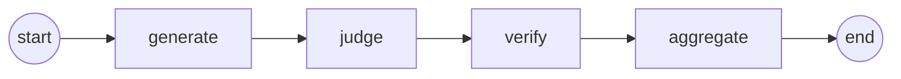

# BharatBench 🇮🇳

An evaluation benchmark for LLMs on Bengali, Hindi, and English across 5 task categories,
with automated LLM-as-judge scoring and language gap analysis.

This is one benchmark among several covering Indic languages (see prior work
like IndicGLUE, IndicXTREME, and MILU) — its contribution is a small,
hand-written question set focused specifically on comparing math/reasoning/
knowledge/instruction/code performance across Bengali, Hindi, and English.
See [Known Limitations](#known-limitations) before drawing conclusions from
its results.

**Status:** Work in progress. No paper has been published yet; the citation
below is a placeholder for when/if one is.

---

## Dataset

| Language | Questions | Categories |
|---|---|---|
| Bengali | 23 | math, reasoning, knowledge, instruction, code |
| Hindi   | 22 | math, reasoning, knowledge, instruction, code |
| English | 22 | math, reasoning, knowledge, instruction, code |
| **Total** | **67** | 5 categories, uneven distribution per language (see `scripts/validate_dataset.py`) |

## Providers & Models Evaluated

Model support is provider-agnostic (`eval/providers/`) — subjects and the
judge are each a `(provider, model_id)` pair (`eval/config.py`), not
hardcoded to one vendor SDK. Currently supported providers:

| Provider | SDK | Env var(s) |
|---|---|---|
| `groq` | `groq` | `GROQ_API_KEY` |
| `sarvam` | `sarvamai` (official SDK) | `SARVAM_API_KEY` |
| `openai` | `openai` (works with any OpenAI-compatible endpoint) | `OPENAI_API_KEY`, optional `OPENAI_BASE_URL` |

| Alias | Provider | Model ID |
|---|---|---|
| llama3-70b | groq | llama-3.3-70b-versatile |
| llama3-8b | groq | llama-3.1-8b-instant |
| gpt-oss-20b | groq | openai/gpt-oss-20b |
| gpt-oss-120b | groq | openai/gpt-oss-120b |
| sarvam-105b | sarvam | sarvam-105b |
| sarvam-30b | sarvam | sarvam-30b |
| sarvam-m | sarvam | sarvam-m |
| gpt-4o-mini | openai | gpt-4o-mini |

`gemma2-9b-it` and `mixtral-8x7b-32768` were deprecated by Groq (2025-10-08
and 2025-03-20 respectively) and are no longer callable; replaced above with
Groq's current production models as of 2026-07-05. Note also that
`llama-3.3-70b-versatile` and `llama-3.1-8b-instant` — the latter is also the
default judge model, see limitations — have a deprecation announced for
2026-08-16 on free/developer tiers; revisit before then.

You only need API keys for the providers whose models you actually evaluate.

### Configuring the judge independently of subjects

By default the judge is `groq`/`llama-3.1-8b-instant` (unchanged from before
this refactor, which is also subject alias `llama3-8b` — see
[Known Limitations](#known-limitations)). To point the judge at a different
provider/model than anything you're evaluating, set both env vars together:

```bash
JUDGE_PROVIDER=openai
JUDGE_MODEL_ID=gpt-4o-mini
```

If a run's subject list ever matches the configured judge exactly,
`runner.py` logs a warning at run time rather than staying silent about it.

## Scoring Dimensions

Each response is scored by the configured judge model on:

- **Correctness** — Factual/mathematical accuracy vs reference answer
- **Completeness** — All parts of the question addressed
- **Language Quality** — Response in correct language, fluent
- **Clarity** — Clear, well-structured explanation

**Overall** = mean of all 4 dimensions

---

## Setup

```bash
pip install -r requirements.txt
cp .env.example .env
# Add API keys for whichever providers you'll use (see table above) --
# GROQ_API_KEY is required for the default --models/--all set.
```

## Run Evaluation

```bash
# Quick test (5 questions per language, 2 models) — ~5 min
python eval/runner.py --quick

# Bengali + Hindi only, 2 models — ~15 min
python eval/runner.py --models llama3-70b llama3-8b --langs bengali hindi

# Mix providers in one run
python eval/runner.py --models llama3-70b sarvam-105b gpt-4o-mini --langs bengali

# Full benchmark (all models, all languages) — ~45 min
python eval/runner.py --all
```

## Analyze Results

```bash
# Print report
python eval/analyze.py results/eval_TIMESTAMP.json

# Generate LaTeX table for paper
python eval/analyze.py results/eval_TIMESTAMP.json --latex

# Generate dashboard JSON
python eval/analyze.py results/eval_TIMESTAMP.json --dashboard
```

---

## FastAPI Evaluation Service

A REST wrapper around the harness for submitting runs and polling results
without a terminal (`service/`).

```bash
pip install -r requirements.txt
export GROQ_API_KEY=...          # + whichever other provider keys you need
uvicorn service.app:app --reload
```

Or with Docker:

```bash
docker build -t bharatbench-service .
docker run -p 8000:8000 --env-file .env bharatbench-service
```

Endpoints:

| Method | Path | Purpose |
|---|---|---|
| GET | `/health` | Liveness check |
| POST | `/eval/runs` | Submit a run: `{"models": [...], "languages": [...], "limit": null}` -> `202` with `run_id` |
| GET | `/eval/runs` | List all runs known to this process |
| GET | `/eval/runs/{run_id}` | Status + progress (`queued`/`running`/`completed`/`failed`) |
| GET | `/eval/runs/{run_id}/results` | Raw per-question results (`409` until completed) |
| GET | `/eval/runs/{run_id}/report` | Aggregated report incl. `language_gap_caveat` field |

Requests are validated with Pydantic (unknown model aliases/languages ->
`422` with the valid set listed in the error). The `/report` response always
includes a `language_gap_caveat` string stating that the language sets
aren't parallel, so anything built on top of the API surfaces that
limitation rather than hiding it behind a raw number — see
[Known Limitations](#known-limitations).

**Job store is in-memory and single-process.** Runs are lost on restart and
aren't shared across worker processes — fine for one instance, but a real
multi-worker production deployment would want a shared store (DB/Redis) and
a task queue (Celery/RQ/arq) in place of `asyncio.create_task`. This is a
known scope boundary, not an oversight.

API tests (`tests/test_service.py`) stub every provider the same way
`tests/test_smoke.py` does — no real API key or network access needed.

---

## LangGraph Evaluation Pipeline

`eval/pipeline.py` reimplements the same eval flow as `eval/runner.py` as an
explicit, inspectable [LangGraph](https://github.com/langchain-ai/langgraph)
graph instead of one function doing everything inline:



- **generate** — runs every (model, question) pair through the subject model. No scoring yet.
- **judge** — scores each generated response with the configured judge (`eval/config.py`'s `JUDGE`).
- **verify** — *new*, not a re-scoring step. Checks internal consistency between what `generate` and `judge` produced (e.g. "a failed model call must score `0.0`, not something else"; "a `judge_parse_failed` record must have `None` scores, not partial ones") and flags anomalies. It does not change any score — scoring semantics are identical to `runner.py`.
- **aggregate** — summarizes the run using the same `eval/analyze.py` functions the CLI/service use, so results are comparable across all three entry points. Always includes a `language_gap_caveat` field for the same reason the FastAPI service's `/report` endpoint does — see [Known Limitations](#known-limitations).

Run it the same way as `runner.py`:

```bash
python eval/pipeline.py --quick
python eval/pipeline.py --models llama3-70b sarvam-105b --langs bengali hindi
```

Results are saved to `results/pipeline_TIMESTAMP.json` in the same shape
`runner.py` produces (plus `aggregate` and per-record `verification_ok`/
`verification_issues` fields), so `eval/analyze.py` can read either file.

---

## Key Research Questions

1. **Language Gap**: How much do models underperform on Bengali/Hindi vs English?
2. **Category Sensitivity**: Which task types (math, reasoning, code) fail most in Indic languages?
3. **Scale Effect**: Do larger models close the Indic language gap?
4. **Instruction Following**: Can models respond in Bengali when asked in Bengali?

---

## Project Structure

```
bharatbench/
├── dataset/
│   ├── schema.json           # JSON Schema for question entries (requires provenance)
│   ├── bengali/questions.json    (23 questions)
│   ├── hindi/questions.json      (22 questions)
│   └── english/questions.json    (22 questions)
├── eval/
│   ├── runner.py      # Multi-model evaluation runner
│   ├── pipeline.py    # Same flow as a LangGraph graph: generate->judge->verify->aggregate
│   ├── analyze.py     # Results analysis + LaTeX + dashboard
│   ├── config.py      # Model + judge registry (provider, model_id)
│   └── providers/     # Provider abstraction: groq, sarvam, openai-compatible
├── service/           # FastAPI wrapper: submit/poll/fetch runs over HTTP
├── scripts/
│   ├── validate_dataset.py   # Schema/provenance validation, report-only
│   ├── decontaminate.py      # n-gram overlap check against a reference corpus
│   └── package_for_hf.py     # Local HF-datasets packaging (does not upload)
├── tests/             # Smoke + API tests, stubbed providers, no API key needed
├── Dockerfile
└── results/            # JSON output files (gitignored)
```

There is no `paper/` folder yet — a prior version of this README referenced
one that was never created.

---

## Known Limitations

- **Judge/subject model overlap (default, avoidable via config).**
  `llama-3.1-8b-instant` is both one of the four default models being
  evaluated and the default LLM-as-judge, scoring every response including
  its own — a known source of self-preference bias. This is now avoidable:
  set `JUDGE_PROVIDER`/`JUDGE_MODEL_ID` to an independent model (see
  "Configuring the judge independently of subjects" above), and `runner.py`
  will warn at run time if a run's subjects still overlap the configured
  judge. The default hasn't been changed, to avoid silently altering scoring
  behavior/comparability — decoupling it is opt-in.
- **Non-parallel language question sets.** The Bengali, Hindi, and English
  question sets are not translations of each other — they cover different
  topics (e.g. Bengali asks about Tagore and the Bangladesh Liberation War;
  Hindi asks about Indian AI companies; English asks about RAG/ReAct). The
  "language gap" metric therefore conflates language-capability differences
  with topic/question-difficulty differences. Read gap numbers as a rough
  signal, not a controlled measurement, until the sets are made parallel.
- **Small, unverified-provenance dataset.** 67 questions total, none currently
  carry a `source`/provenance field (tracked mechanically by
  `scripts/validate_dataset.py`, not yet resolved). An engineering audit also
  surfaced at least one question with a reference answer that doesn't fully
  resolve the question asked — dataset content is intentionally out of scope
  for this pass and hasn't been corrected.
- **`requires_tool` is not enforced.** Questions flagged as needing a
  calculator or code execution are currently answered via plain chat
  completion with no tool augmentation. The field is informational only;
  wiring up real tool execution would need a sandboxed code-execution path
  and a separate scoring rubric for tool-augmented answers, which is out of
  scope for the current harness.

---

## Citation

No paper has been published for this project. If you use this benchmark,
please cite the repository directly rather than the placeholder below, which
is left here only in case a paper is published later:

```bibtex
@misc{hazra2025bharatbench,
  title   = {BharatBench: Benchmarking Large Language Models on Indic Language Tasks},
  author  = {Hazra, Shraman},
  year    = {2025},
  note    = {Unpublished. https://github.com/Shraman123/bharatbench}
}
```

---

## Contributing

See [CONTRIBUTING.md](CONTRIBUTING.md) — in particular, all new questions
must include a `source`/provenance field and be human-verified.

## License

[MIT](LICENSE) for the code. The dataset content (questions/reference
answers) is included under the same license for now; if you plan to reuse
the dataset specifically, check back here as this may be revisited with a
data-specific license.
